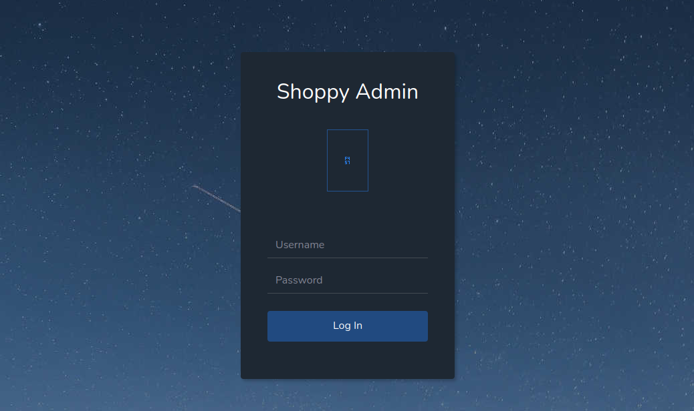

### 一、信息收集
1. 端口扫描
```shell
nmap -A 10.10.11.180
### 存在端口22及80,并且出现域名http://shoppy.htb/
```

2. 目录扫描
```shell
dirsearch -u http://shoppy.htb/ 
### 发现存在login页面，可能存在登录页面
```



3. 子域名爆破
```shell
gobuster vhost -u http://shoppy.htb/ -w /home/kali/projects/fuzzDicts/subdomainDicts/main.txt
### 出现子域名：http://mattermost.shoppy.htb/
### 该页面也是登录页面
```

### 二、漏洞利用
https://blog.csdn.net/qq_45894840/article/details/127527914